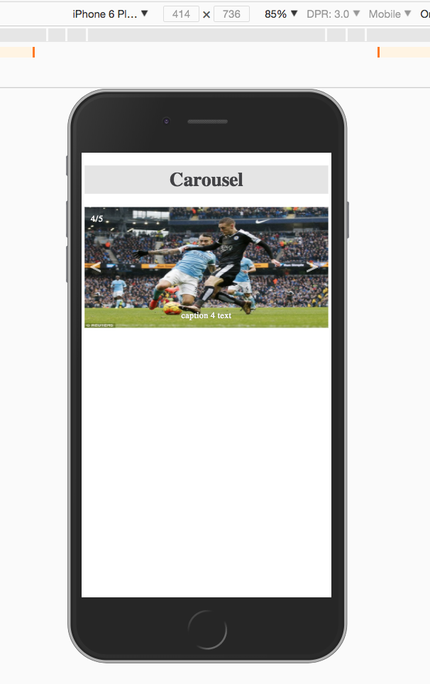

## advanced styling/ RWD  notes &nbsp; :clipboard:
<kbd>(a Michigan State University, online course) &nbsp; :rooster:</kbd>

+ what makes for good responsive design .
+ the role of fluid measurements . 
+ media queries  
  - best practice   
  - breakpoints   
+ frameworks  
  - benefits/pitfalls   
+ Bootstrap 3  
  - grid system   
  - navigation bar   
  - advanced techniques   
+ case studies   :bomb:

 

<kbd>bootstrap</kbd>

 
<kbd>carousel mobile-first, no bootstrap</kbd>

