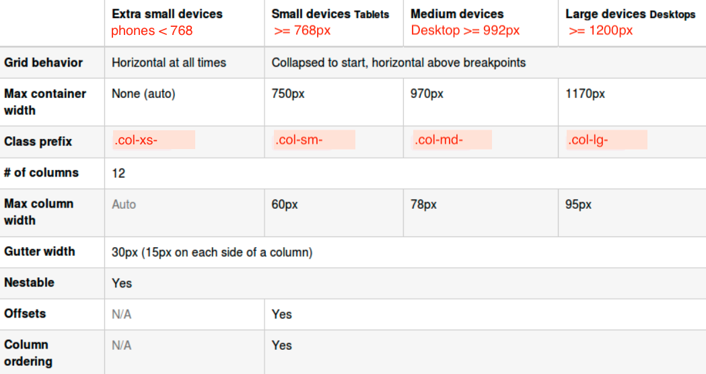

## bootstrap grid system

- 12 column layout  &nbsp; :straight_ruler:

- every grid consists of:
  + a Container
    + a Row
      + one or more column classes

```
   ex:
      <div class="container">
        <div class="row">
          <div class="col-xx-yy">

   xx => xs, sm, md, lg

   yy => 0..12

```
<kbd>grid</kbd><br/>


<hr/>
<br/>

&nbsp; :black_nib: &nbsp; notesA:

- classes propagate from small to large
- if you don't specify nothing for large, then whatever you specify for
  medium will propagate for large

- on viewports ***md*** and ***lg*** there is an option for pull and push

`col-xx-push`    
  + ***col--xx-yy*** -> move `yy` number of columns to the ***right***

`col-xx-pull`   
  + ***col--xx-yy*** -> move `yy` number columns to the ***left***

  + ***hidden-xx*** -> content will only be hidden on the **xx** screen size
    (make this visible on every viewport except for the one, we're mentioning here)

  + ***visible-xx*** -> content will only be visible on the **xx** screen size
    (hide something, unless i'm on certain screen size)

  + ***sr-only*** -> content is hidden on all devices except screen readers    


### notesB &nbsp; :closed_book:

- bootstrap is mobile first, larger screens inherit values from smaller screens
- rows must be placed within a ***.container***
- use rows to create horizontal group of columns
- content should be placed within columns and ***only*** columns may be
  immediate children of rows

- helper classes:
  + .clearfix
  + .col-xx-offset
  + .col-xx-push
  + .col-xx-pull


