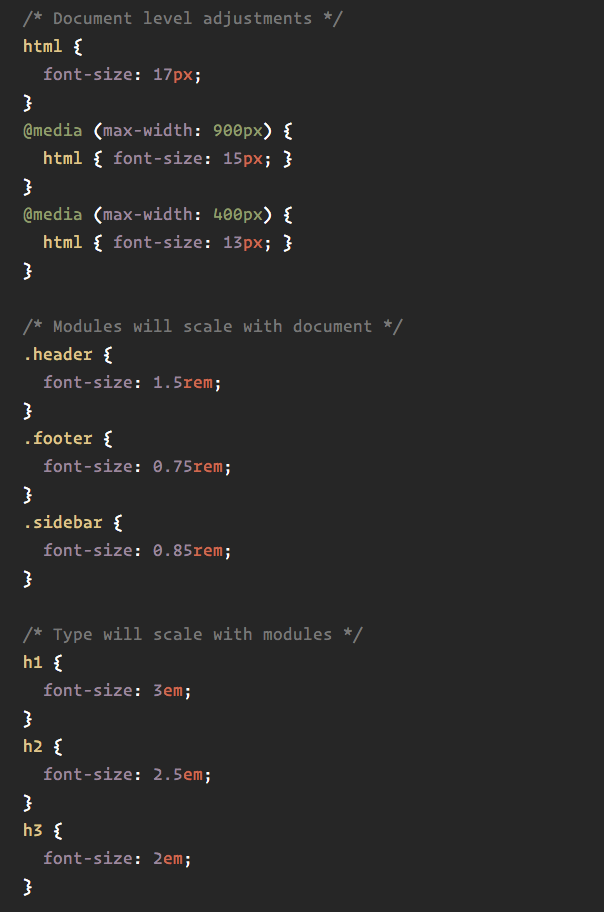

## RWD . &nbsp; 📄 

- designing sites with multiple screen sizes/resolutions in mind.
- sites should work under any platform, any browser size, any orientation.
- a small screen ***should not*** mean less content, just things need to be 
  layout more intelligently
- never assume the user won't need access to a functionality

## concepts to consider

- media queries - detecting viewport
- flexible grid-based layout for relative sizing
- flexible images

## RWD options &nbsp; :fishing_pole_and_fish:

- responsive web design => fluid measurements, flexible grids, css rules
- adaptive design => returns one of multiple versions of a page based on device
- separate mobile site => separate page URL for mobile

### is it responsive? 
- if the server is sending back the same code regardless of the device, 
  ***you are using RWD***
- this can be detected automatically, by looking for ***meta name = 
  "viewport"***
- adaptive is when the server returns different code (Html and Css) depending
  on the device requesting the page. (The same URL is used.)     
- Dedicated mobile site, a separate URL serves different code to desktop and 
  mobile devices

### why RWD? &nbsp; :ship:
- easier to share your data with a single URL
- easier for search engines to index the page
- fewer files = less maintenance
- less redirection = lower load time


### fluid measurements 

#### absolute measurements:  &nbsp; :triangular_ruler:
- ***pixel*** 
  + 1 pixel is equal to 1/96th of 1 inch . (see font-size def below)

- mm,cm, in

- ***pt***
  + 1 point is 1/72 of an inch.

- ***pc***
  + 1 pica is equal to 12 points


#### relative measurements   &nbsp; :triangular_ruler:

- ***%***
  + percentage values are always relative to another value, for example length

- ***em***
  + font size of the element (font size gets smaller as you start nesting)
  + in general an em is the equal to 16px

- ***rem***
  + font size of the root element (see image below)

- ***vw*** (for viewport width)
  + viewport's width, is 1/100th of the width of the viewport
  + vw finds the width of the browser, returns it and gets 1/100 value.

- ***vh*** (for viewport height)
  + viewport's height is 1/100th of the height of the viewport


<kbd>rem for font-size</kbd>




### choosing the right metric is critical for responsive interfaces

+ ***pixels***
pixels are an absolute unit of measurement - meaning they are the same size regardless of the size of anything else.
once the pixel value is chosen for a font, the type size will remain the same across all devices and browsers.
```For example``` setting a pixel value to the body's font-size, will permeate nearly
all other elements. Then you have to override manually in order to set different values.

+ ***ems***
ems are a relative measurement of lenght.   
the size of an em is ***relative to the font-size of its parent element***.      
```
  ex:
  Let's say the font-size of a <div> is 16px. Inside the <div> you have a <p>, you can then set that font-size of the <p> to 2em and that will be equal to 32px.
  But let's say you have a blockquote element inside the p, and you set that to 1em, you will then get 16px.    
  16px inside the quote because is now relative to the <p> and not the font-size set at the <div>.   
  The <p> tag is now 2em or 32px, then half of that (or 1em) would be 16px.
```

+ ***percentages***
just like ems, percentages ***are resizeable units*** for font size and their Css declarations can be inherited. There isn't a big difference between ***ems*** and ***percentages***.      
One way to rule out percentages is to set:
```
 { font-size: 100%; }

```

+ ***rems***
its behaviour is similar to that of the em unit, with one main difference:    
    - ***its value it's relative to the root element of the document***     
    - ***nesting*** its ***irrelevant*** here unlike <ems>     
    - ***rems*** are always relative to the font-size of the top level ***<html> element***   
    - not supported by all browsers, still a relatively new unit

### pixels, ems, and rems in common &nbsp; :space_invader:
each is a unit of length used to define the size of elements on a webpage.
They can be used on divs, margins, padding and so on.

### difference between ems and rems &nbsp; :space_invader:
although both are relative units of measurement, with rems you only define your font-size once (at the top level <html> element), then everything is relative to that.        
With ems, you need to always remember the parent's font-size, because it changes as you start nesting.


