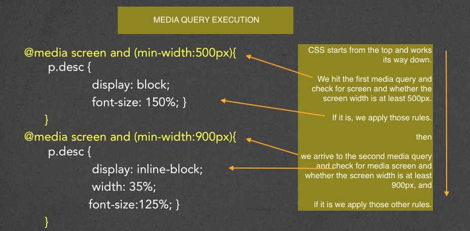

## 2 Media Query components

1- a media type (screen, all, print)

2- the actual query of a media feature and "trigger" size
  + width, height, orientation, resolution ...

```
  ex:
      screen and (max-device-width: 480px) and (resolution:163dpi)

```

### 3 ways to implement Media Queries

1- Using the ***@import*** rule
```
   ex:
      @import url(smallstyle.css) screen and (min-width:600px)
  
```   

2- Putting media query directly in the style sheet
```
   ex:
      @media screen and (min-width:500px) {...}

```

3- Including media query in the link
```
   ex:
      <link rel= "stylesheet" media="screen and (min-width:400px) and (orientation:portrait)">


```

<hr/>
<br/>

<kbd>media query execution</kbd>




